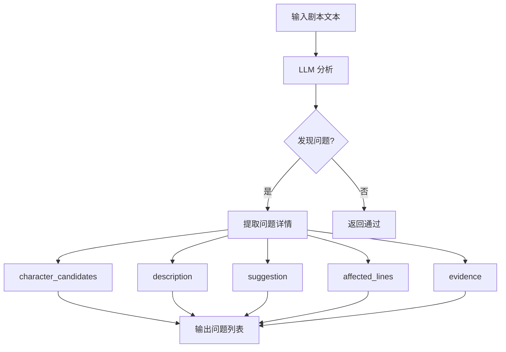

# 一致性检查模块深度解析

## 模块概述

**位置**: `app/chains/agents/consistency_checker_agent.py`

**核心功能**: 检测剧本中的角色混淆问题

**输入**: 剧本文本

**输出**: 一致性检查结果（问题列表 + 修改建议）

---

## 一、核心原理

### 1.1 什么是角色混淆？

角色混淆是指在剧本中，**同一个角色**在不同段落/镜头中被赋予了不同的身份或行为主体，导致读者/观众产生困惑。

#### 常见类型

**类型1: 同名不同人**
```
错误示例:
第1幕: 小王子是一个金发男孩
第3幕: 小王子是一位老人（实际应该是"国王"）
```

**类型2: 代词指代混乱**
```
错误示例:
陆景琛和林小暖在办公室。他走过去拿起文件。
（"他"指代不明确，可能是陆景琛或林小暖）
```

**类型3: 行为归属错位**
```
错误示例:
第2幕: 林小暖泼了咖啡
第4幕: 陆景琛为泼咖啡的事道歉（行为主体错位）
```

**类型4: 称呼不一致**
```
错误示例:
第1幕: 陆景琛
第2幕: 陆总
第3幕: 景琛
第4幕: 小陆（称呼混乱，需统一）
```

### 1.2 检查原理



---

## 二、数据结构

### 2.1 ScriptConsistencyIssue（单个问题）

```python
class ScriptConsistencyIssue(BaseModel):
    """角色混淆类一致性问题"""
    
    issue_type: Literal["character_confusion"] = "character_confusion"
    # 固定为 "character_confusion"
    
    character_candidates: List[str]
    # 涉及的角色候选名称
    # 例如: ["小王子", "男孩", "金发少年"]
    
    description: str
    # 问题描述（为什么会混淆）
    # 例如: "第1幕称'小王子'，第3幕称'男孩'，可能让读者误以为是不同角色"
    
    suggestion: str
    # 修改建议（如何改写以消除混淆）
    # 例如: "统一使用'小王子'作为角色称呼"
    
    affected_lines: Optional[Dict[str, int]]
    # 受影响的行号范围
    # 例如: {"start_line": 10, "end_line": 15}
    
    evidence: List[EvidenceSpan]
    # 原文依据（可选）
    # 例如: [{"text": "男孩说", "line": 12}]
```

### 2.2 ScriptConsistencyCheckResult（检查结果）

```python
class ScriptConsistencyCheckResult(BaseModel):
    """一致性检查结果"""
    
    has_issues: bool
    # 是否发现问题
    
    issues: List[ScriptConsistencyIssue]
    # 问题列表
    
    summary: Optional[str]
    # 总结（可选）
    # 例如: "发现2个角色混淆问题，建议统一称呼"
```

---

## 三、System Prompt 分析

### 3.1 完整 Prompt

```python
_CONSISTENCY_CHECKER_SYSTEM_PROMPT = """
你是"一致性检查员"。只做一件事：检测原文中是否把"同一个角色"在不同段落/镜头中赋予了不同的身份或行为主体，导致角色混淆（例如：同名不同人、代词指代混乱、行为归属错位）。

输出 ScriptConsistencyCheckResult：
- issues: 每条问题必须包含 character_candidates、description、suggestion；尽量给出 affected_lines（start_line/end_line）。
- has_issues: issues 非空则为 true

只输出 JSON。
"""
```

### 3.2 Prompt 设计要点

| 要点 | 说明 | 目的 |
|------|------|------|
| "只做一件事" | 聚焦角色混淆 | 避免检查范围过宽 |
| "同一个角色" | 强调身份一致性 | 明确检查目标 |
| "不同身份或行为主体" | 具体化混淆类型 | 提供判断标准 |
| "必须包含" | 强制字段要求 | 保证输出完整性 |
| "尽量给出" | 可选字段提示 | 提高输出质量 |
| "只输出 JSON" | 格式约束 | 便于解析 |

---

## 四、工作流程

### 4.1 完整流程

```
1. 接收剧本文本
   ↓
2. 构建 System Prompt + User Prompt
   ↓
3. 调用 LLM
   ↓
4. 解析 JSON 输出
   ↓
5. 规范化数据
   ↓
6. 返回 ScriptConsistencyCheckResult
```

### 4.2 规范化处理

```python
def _normalize(self, data: dict[str, Any]) -> dict[str, Any]:
    """规范化一致性检查结果（角色混淆）。"""
    data = dict(data)
    
    # 确保 issues 字段存在且为列表
    if "issues" not in data or not isinstance(data["issues"], list):
        data["issues"] = []
    
    # 为每个问题补全默认值
    for it in data["issues"]:
        if isinstance(it, dict):
            it.setdefault("issue_type", "character_confusion")
            it.setdefault("character_candidates", [])
            it.setdefault("affected_lines", None)
            it.setdefault("evidence", [])
    
    # 自动计算 has_issues
    if "has_issues" not in data:
        data["has_issues"] = len(data["issues"]) > 0
    
    # 补全 summary
    if "summary" not in data:
        data["summary"] = None
    
    return data
```

---

## 五、实际案例分析

### 5.1 案例1: 无问题剧本

**输入剧本**:
```
陆景琛是陆氏集团的总裁。
林小暖是新来的实习生。
陆景琛对林小暖说："你好。"
林小暖回答："陆总好。"
```

**LLM 输出**:
```json
{
    "has_issues": false,
    "issues": [],
    "summary": "未发现角色混淆问题。角色称呼一致，无代词指代混乱。"
}
```

**解析结果**:
```python
ConsistencyCheckResult(
    has_issues=False,
    issues=[],
    summary="未发现角色混淆问题。角色称呼一致，无代词指代混乱。"
)
```

### 5.2 案例2: 称呼不一致

**输入剧本**:
```
第1幕: 小王子住在B612星球。
第2幕: 男孩遇到了飞行员。
第3幕: 金发少年说："请给我画一只羊。"
```

**LLM 输出**:
```json
{
    "has_issues": true,
    "issues": [
        {
            "issue_type": "character_confusion",
            "character_candidates": ["小王子", "男孩", "金发少年"],
            "description": "同一角色在不同幕中使用了三种不同称呼，可能让读者误以为是不同角色",
            "suggestion": "统一使用'小王子'作为主要称呼，或在首次出现时明确说明'小王子（金发少年）'",
            "affected_lines": {
                "start_line": 1,
                "end_line": 3
            },
            "evidence": [
                {"text": "小王子住在B612星球", "line": 1},
                {"text": "男孩遇到了飞行员", "line": 2},
                {"text": "金发少年说", "line": 3}
            ]
        }
    ],
    "summary": "发现1个角色混淆问题，建议统一角色称呼"
}
```

**解析结果**:
```python
ConsistencyCheckResult(
    has_issues=True,
    issues=[
        ConsistencyIssue(
            issue_type="character_confusion",
            character_candidates=["小王子", "男孩", "金发少年"],
            description="同一角色在不同幕中使用了三种不同称呼...",
            suggestion="统一使用'小王子'作为主要称呼...",
            affected_lines={"start_line": 1, "end_line": 3},
            evidence=[...]
        )
    ],
    summary="发现1个角色混淆问题，建议统一角色称呼"
)
```

### 5.3 案例3: 代词指代混乱

**输入剧本**:
```
陆景琛和林小暖在办公室。
他走过去拿起文件。
她看着他。
他说："这是你的。"
```

**LLM 输出**:
```json
{
    "has_issues": true,
    "issues": [
        {
            "issue_type": "character_confusion",
            "character_candidates": ["陆景琛", "林小暖"],
            "description": "第2行'他'指代不明确，可能是陆景琛或林小暖（虽然林小暖是女性，但在快速阅读时容易混淆）",
            "suggestion": "将'他走过去'改为'陆景琛走过去'，明确行为主体",
            "affected_lines": {
                "start_line": 2,
                "end_line": 2
            }
        }
    ],
    "summary": "发现1个代词指代混乱问题"
}
```

---

## 六、独立性分析

### 6.1 依赖关系

```
ConsistencyChecker
    ↓
AgentBase (基类)
    ↓
├── LangChain (BaseChatModel)
├── Pydantic (BaseModel)
└── PromptTemplate
```

### 6.2 可独立化程度

| 组件 | 依赖 | 可独立化 | 方案 |
|------|------|----------|------|
| System Prompt | 无 | ✅ 完全独立 | 直接复制字符串 |
| User Prompt | 无 | ✅ 完全独立 | 简单字符串模板 |
| 数据模型 | Pydantic | ✅ 可替代 | 用 dataclass 或 dict |
| LLM 调用 | LangChain | ✅ 可替代 | 用函数接口 |
| JSON 解析 | 标准库 | ✅ 完全独立 | json.loads() |

**结论**: ✅ **可以完全独立化**

---

## 七、独立组件设计

### 7.1 接口定义

```python
def check_consistency(
    script_text: str,
    llm_call: Callable[[str], str]
) -> Dict[str, Any]:
    """
    检查剧本一致性
    
    Args:
        script_text: 剧本文本
        llm_call: LLM 调用函数，接收 prompt 返回响应
    
    Returns:
        {
            "has_issues": bool,
            "issues": [
                {
                    "issue_type": "character_confusion",
                    "character_candidates": ["角色A", "角色B"],
                    "description": "问题描述",
                    "suggestion": "修改建议",
                    "affected_lines": {"start_line": 10, "end_line": 15},
                    "evidence": [...]
                }
            ],
            "summary": "总结"
        }
    """
```

### 7.2 使用示例

```python
# 定义 LLM 调用函数
def my_llm(prompt: str) -> str:
    # 调用你的 LLM API
    return llm_api.call(prompt)

# 检查一致性
result = check_consistency(
    script_text="你的剧本...",
    llm_call=my_llm
)

# 处理结果
if result["has_issues"]:
    for issue in result["issues"]:
        print(f"问题: {issue['description']}")
        print(f"建议: {issue['suggestion']}")
```

---

## 八、优势与局限

### 8.1 优势

✅ **聚焦明确**: 只检查角色混淆，不做其他检查  
✅ **输出结构化**: JSON 格式，易于解析  
✅ **提供建议**: 不仅指出问题，还给出修改方案  
✅ **可溯源**: 提供 affected_lines 和 evidence  
✅ **易于集成**: 接口简单，依赖少  

### 8.2 局限

⚠️ **依赖 LLM 质量**: 检查准确性取决于 LLM 能力  
⚠️ **仅检查角色混淆**: 不检查其他类型的一致性问题  
⚠️ **无法检测逻辑错误**: 如时间线混乱、情节矛盾  
⚠️ **中文理解**: 对于复杂的中文语境可能有误判  

---

## 九、改进方向

### 9.1 短期改进

1. **增加检查类型**
   - 时间线一致性
   - 地点一致性
   - 道具一致性

2. **提高准确性**
   - Few-shot 示例
   - 更详细的 Prompt
   - 多轮验证

3. **增强可溯源性**
   - 更精确的行号定位
   - 更详细的 evidence

### 9.2 长期扩展

1. **多语言支持**
   - 英文剧本检查
   - 其他语言支持

2. **自动修复**
   - 直接生成修复后的剧本
   - 提供多个修复方案

3. **可视化**
   - 问题高亮显示
   - 交互式修改界面

---

## 十、总结

### 核心价值

✅ **专注**: 只做角色混淆检查，做到极致  
✅ **实用**: 输出结构化，易于集成  
✅ **独立**: 可完全解耦，无重依赖  

### 适用场景

- 剧本创作辅助
- 剧本质量检查
- 自动化剧本处理流程
- AI 写作工具

### 独立化可行性

**评分**: ⭐⭐⭐⭐⭐ (5/5)

**理由**:
- 依赖少（仅需 LLM 调用接口）
- 接口简单（输入文本，输出 JSON）
- 功能明确（角色混淆检查）
- 易于测试（Mock LLM 即可）

**结论**: ✅ **强烈推荐独立化为单独组件**
