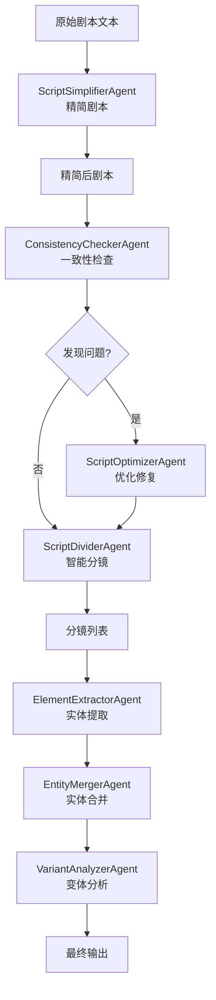

# Jellyfish 剧本处理流程解耦分析

## 核心处理流程

Jellyfish 的剧本处理采用 **Agent 模式**，每个处理步骤都是一个独立的 Agent。

### 处理流程图



## Agent 架构解析

### 1. 基类架构 (AgentBase)

**位置**: `app/chains/agents/base.py`

**核心职责**:
- 封装 LangChain LLM 调用
- 统一 Prompt 模板管理
- JSON 输出解析与修复
- 结构化输出验证

**关键方法**:
```python
class AgentBase(Generic[T]):
    def __init__(self, llm: BaseChatModel):
        self.llm = llm
    
    @abstractmethod
    def system_prompt(self) -> str:
        """系统提示词"""
        pass
    
    @abstractmethod
    def prompt_template(self) -> PromptTemplate:
        """用户提示词模板"""
        pass
    
    @abstractmethod
    def output_model(self) -> type[T]:
        """输出数据模型（Pydantic）"""
        pass
    
    def extract(self, **kwargs) -> T:
        """同步调用 LLM 并解析输出"""
        pass
    
    async def aextract(self, **kwargs) -> T:
        """异步调用 LLM 并解析输出"""
        pass
```

### 2. 四个核心文本处理 Agent

#### Agent 1: ScriptSimplifierAgent (精简剂)

**位置**: `app/chains/agents/script_simplifier_agent.py`

**输入**:
- `script_text`: 原始剧本文本

**输出** (ScriptSimplificationResult):
```python
{
    "simplified_script_text": "精简后的剧本",
    "simplification_summary": "精简策略说明"
}
```

**核心逻辑**:
- 删除冗余描述和修饰
- 保留核心剧情和因果关系
- 不改变主线走向

**System Prompt 要点**:
```
- 保留剧情主体（关键事件、冲突、转折、结局）
- 保证剧情连续（时间、因果、动机衔接）
- 禁止新增关键设定
- 删除冗余重复、弱信息修饰
```

---

#### Agent 2: ConsistencyCheckerAgent (一致性检查员)

**位置**: `app/chains/agents/consistency_checker_agent.py`

**输入**:
- `script_text`: 剧本文本

**输出** (ScriptConsistencyCheckResult):
```python
{
    "has_issues": true,
    "issues": [
        {
            "issue_type": "character_confusion",
            "character_candidates": ["小王子", "男孩"],
            "description": "角色称呼不一致",
            "suggestion": "统一使用'小王子'",
            "affected_lines": {"start_line": 10, "end_line": 15},
            "evidence": ["第10行称'男孩'，第15行称'小王子'"]
        }
    ],
    "summary": "发现1个角色混淆问题"
}
```

**核心逻辑**:
- 检测同一角色的不同称呼
- 识别代词指代混乱
- 发现行为归属错位

**System Prompt 要点**:
```
- 只检测角色混淆（同名不同人、代词混乱、行为归属错位）
- 必须给出 character_candidates、description、suggestion
- 尽量标注 affected_lines
```

---

#### Agent 3: ScriptOptimizerAgent (优化师)

**位置**: `app/chains/agents/script_optimizer_agent.py`

**输入**:
- `script_text`: 原始剧本
- `consistency_json`: 一致性检查结果（JSON字符串）

**输出** (ScriptOptimizationResult):
```python
{
    "optimized_script_text": "优化后的剧本",
    "change_summary": "逐条改动说明"
}
```

**核心逻辑**:
- 仅修复一致性问题
- 最小化改动范围
- 只改相关段落

**System Prompt 要点**:
```
- 仅当发现角色混淆时才改写
- 最小改写，只改与 issues 相关的段落
- 逐条对应 issues 给出改动摘要
```

---

#### Agent 4: ScriptDividerAgent (分镜师)

**位置**: `app/chains/agents/script_divider_agent.py`

**输入**:
- `script_text`: 剧本文本

**输出** (ScriptDivisionResult):
```python
{
    "total_shots": 6,
    "shots": [
        {
            "index": 1,
            "start_line": 1,
            "end_line": 15,
            "shot_name": "飞机坠机",
            "script_excerpt": "黄昏时分，撒哈拉沙漠...",
            "time_of_day": "黄昏"
        }
    ],
    "notes": "分镜说明"
}
```

**核心逻辑**:
- 识别场景边界
- 提取镜头名称
- 标注时间信息

**System Prompt 要点**:
```
- 每个镜头是完整连贯场景
- 提供 index、start_line、end_line、shot_name、script_excerpt、time_of_day
- shot_name 是一句话描述画面/动作，不是场景名
```

**特殊处理**:
- 支持多种 JSON 格式（列表、嵌套对象）
- 自动补全 index
- 兼容 title/shot_title 字段
- 移除废弃字段（scene_name, character_names_in_text）

## 解耦方案

### 方案 1: 独立模块化

将每个 Agent 提取为独立的 Python 模块，无需依赖 LangChain。

**目录结构**:
```
script_processors/
├── __init__.py
├── base.py                 # 基础接口定义
├── simplifier.py           # 精简器
├── consistency_checker.py  # 一致性检查
├── optimizer.py            # 优化器
├── divider.py              # 分镜器
├── schemas.py              # 数据模型
└── utils.py                # 工具函数
```

**接口定义** (base.py):
```python
from abc import ABC, abstractmethod
from typing import Generic, TypeVar, Dict, Any

T = TypeVar('T')

class ScriptProcessor(ABC, Generic[T]):
    """剧本处理器基类"""
    
    @abstractmethod
    def process(self, input_data: Dict[str, Any]) -> T:
        """处理输入并返回结构化输出"""
        pass
    
    @abstractmethod
    def get_prompt(self, input_data: Dict[str, Any]) -> str:
        """生成 LLM 提示词"""
        pass
    
    @abstractmethod
    def parse_output(self, raw_output: str) -> T:
        """解析 LLM 输出"""
        pass
```

### 方案 2: 纯函数式

将每个处理步骤实现为纯函数，便于单元测试。

**示例** (simplifier.py):
```python
from typing import Dict, Any
import json

def generate_simplifier_prompt(script_text: str) -> str:
    """生成精简剂提示词"""
    system_prompt = """
    你是"智能精简剧本Agent"。你的任务是：在不改变核心剧情走向的前提下精简剧本。
    
    强约束：
    - 必须保留剧情主体（关键事件、关键冲突、关键转折、结局/阶段性结果）。
    - 必须保证剧情连续（时间顺序、因果关系、角色动机衔接不能断裂）。
    - 禁止凭空新增关键设定或关键事件。
    - 精简优先删除冗余重复描述、弱信息修饰、对主线无贡献的枝节句。
    
    输出 JSON 格式：
    {
        "simplified_script_text": "精简后的剧本",
        "simplification_summary": "精简策略说明"
    }
    """
    
    user_prompt = f"## 原文剧本\n{script_text}\n\n## 输出\n"
    
    return f"{system_prompt}\n\n{user_prompt}"


def parse_simplifier_output(raw_output: str) -> Dict[str, Any]:
    """解析精简剂输出"""
    # 提取 JSON
    import re
    match = re.search(r'```(?:json)?\s*([\s\S]*?)\s*```', raw_output)
    if match:
        json_str = match.group(1).strip()
    else:
        json_str = raw_output.strip()
    
    # 解析
    data = json.loads(json_str)
    
    # 规范化
    if "simplified_script_text" not in data:
        data["simplified_script_text"] = data.get("optimized_script_text", "")
    if "simplification_summary" not in data:
        data["simplification_summary"] = data.get("change_summary", "")
    
    return data


def simplify_script(script_text: str, llm_call_func) -> Dict[str, Any]:
    """精简剧本（完整流程）"""
    prompt = generate_simplifier_prompt(script_text)
    raw_output = llm_call_func(prompt)
    return parse_simplifier_output(raw_output)
```

### 方案 3: 配置驱动

将 Prompt 和解析逻辑配置化，便于调整和测试。

**配置文件** (prompts.yaml):
```yaml
simplifier:
  system_prompt: |
    你是"智能精简剧本Agent"。你的任务是：在不改变核心剧情走向的前提下精简剧本。
    
    强约束：
    - 必须保留剧情主体（关键事件、关键冲突、关键转折、结局/阶段性结果）
    - 必须保证剧情连续（时间顺序、因果关系、角色动机衔接不能断裂）
    - 禁止凭空新增关键设定或关键事件
    
    输出 JSON 格式：
    {
        "simplified_script_text": "精简后的剧本",
        "simplification_summary": "精简策略说明"
    }
  
  user_template: |
    ## 原文剧本
    {script_text}
    
    ## 输出
  
  output_schema:
    type: object
    required:
      - simplified_script_text
      - simplification_summary
    properties:
      simplified_script_text:
        type: string
      simplification_summary:
        type: string
  
  field_mapping:
    optimized_script_text: simplified_script_text
    change_summary: simplification_summary

consistency_checker:
  system_prompt: |
    你是"一致性检查员"。只做一件事：检测原文中是否把"同一个角色"在不同段落/镜头中赋予了不同的身份或行为主体。
    
    输出 JSON 格式：
    {
        "has_issues": true/false,
        "issues": [
            {
                "issue_type": "character_confusion",
                "character_candidates": ["角色A", "角色B"],
                "description": "问题描述",
                "suggestion": "修改建议",
                "affected_lines": {"start_line": 10, "end_line": 15}
            }
        ]
    }
  
  user_template: |
    ## 原文剧本
    {script_text}
    
    ## 输出
```

## 独立测试框架

### 测试工具 (test_framework.py)

```python
import json
from typing import Dict, Any, Callable
from pathlib import Path

class MockLLM:
    """模拟 LLM 调用（用于测试）"""
    
    def __init__(self, responses: Dict[str, str]):
        self.responses = responses
        self.call_count = 0
    
    def __call__(self, prompt: str) -> str:
        self.call_count += 1
        # 根据 prompt 关键词返回预设响应
        for key, response in self.responses.items():
            if key in prompt:
                return response
        return '{"error": "No matching response"}'


class ProcessorTester:
    """处理器测试框架"""
    
    def __init__(self, processor_func: Callable):
        self.processor_func = processor_func
        self.test_cases = []
    
    def add_test_case(self, name: str, input_data: Dict[str, Any], 
                     expected_output: Dict[str, Any], mock_response: str):
        """添加测试用例"""
        self.test_cases.append({
            'name': name,
            'input': input_data,
            'expected': expected_output,
            'mock_response': mock_response
        })
    
    def run_tests(self):
        """运行所有测试"""
        results = []
        for case in self.test_cases:
            mock_llm = MockLLM({case['name']: case['mock_response']})
            
            try:
                output = self.processor_func(
                    **case['input'],
                    llm_call_func=mock_llm
                )
                
                passed = self._compare_output(output, case['expected'])
                results.append({
                    'name': case['name'],
                    'passed': passed,
                    'output': output,
                    'expected': case['expected']
                })
            except Exception as e:
                results.append({
                    'name': case['name'],
                    'passed': False,
                    'error': str(e)
                })
        
        return results
    
    def _compare_output(self, actual: Dict, expected: Dict) -> bool:
        """比较输出是否符合预期"""
        for key, value in expected.items():
            if key not in actual:
                return False
            if isinstance(value, dict):
                if not self._compare_output(actual[key], value):
                    return False
            elif actual[key] != value:
                return False
        return True


# 使用示例
def test_simplifier():
    tester = ProcessorTester(simplify_script)
    
    # 测试用例1: 正常精简
    tester.add_test_case(
        name='normal_simplification',
        input_data={'script_text': '这是一个很长很长的剧本...'},
        expected_output={
            'simplified_script_text': '这是精简后的剧本',
            'simplification_summary': '删除了冗余描述'
        },
        mock_response=json.dumps({
            'simplified_script_text': '这是精简后的剧本',
            'simplification_summary': '删除了冗余描述'
        })
    )
    
    # 测试用例2: 字段兼容性
    tester.add_test_case(
        name='field_compatibility',
        input_data={'script_text': '测试剧本'},
        expected_output={
            'simplified_script_text': '精简剧本',
            'simplification_summary': '说明'
        },
        mock_response=json.dumps({
            'optimized_script_text': '精简剧本',  # 旧字段名
            'change_summary': '说明'  # 旧字段名
        })
    )
    
    results = tester.run_tests()
    
    for result in results:
        status = "✓" if result['passed'] else "✗"
        print(f"{status} {result['name']}")
        if not result['passed']:
            print(f"  Expected: {result.get('expected')}")
            print(f"  Got: {result.get('output')}")
            if 'error' in result:
                print(f"  Error: {result['error']}")
```

## 完整解耦示例

我将创建一个完整的独立测试包：

